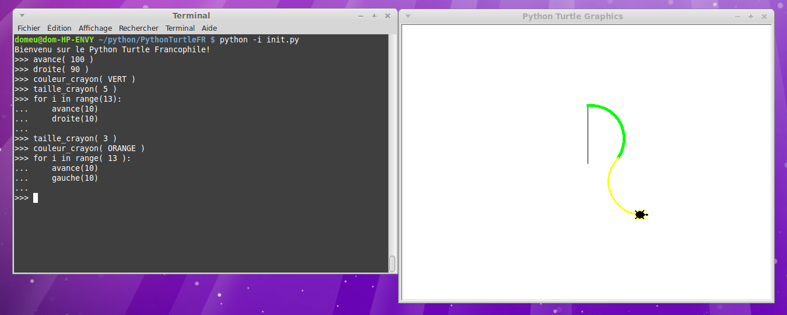

# Python Turtle pour Francophiles

Python Turtle permet de faire du Logo en Python.

C'est génial mais malheureusement totalement en anglais... ce qui ne convient pas forcement pour nos plus jeunes.

Ce GitHub propose le fichier `init.py` qui permet de configurer les __fonctions Logo en Français__. 
Les fonctions anglophones restent disponibles.



Par ailleurs, l'écran graphique est préconfigurée en 640 x 480px et la tortue orientée vers le haut - à l'identique de Logo pour Commodore 64 datant de 1985. Fixe également le mode de couleur 255 permettant de définir une couleur RGB avec un triplet de valeur entre 0 et 255 (comme sur le Web et la plupart des langages modernes)

# Pour démarrer 

Rien de plus simple:
* rendez-vous dans le répertoire contenant le fichier `init.py`
* puis saisir la commande `python -i init.py`

Le __-i__ est important car il indique à l'interpréteur qu'il doit resté en mode interactif après le chargement de `init.py`.

# Fonctions Logo disponibles
 
* `avance( _dist_ )`: avance la tortue sur une distance donnée. Voir aussi `av()`.
* `recule( _dist_ )`: recule la tortue sur une distance donnée. Voir aussi `re()`.
* `droite( _angle_ )`: effectue une rotation de la tortue sur la droite d'un angle X. Voir aussi `dr()`.
* `gauche( _angle_ )`: effectue une rotation de la tortue sur la gauche d'un angle X. Voir aussi `ga()`.
* `taille_crayon( _epaisseu_ )`: permet de définir la taille / épaisseur du crayon. Taille en points. Voir aussi `tc()`.
* `couleur_crayon( _couleur_ )`: permet de définir la couleur du crayon en fonction du `colormode()` 255. Voir aussi `cc( _couleur_ )`. 
* `leve_crayon()` : lève le crayon de la tortue (donc elle cesse de dessiner durant ses déplacements). Voir aussi `lc()`.
* `baise_crayon()`: baisse le crayon de la tortue (donc elle dessine durant ses déplacements). Voir aussi `bc()`.
* `forme( _FORME_ )`: Permet de modifier la forme de la tortue. Constante ci-dessous.
* `origine` : déplace la tortue au point d'origine. Tortue pointant vers le haut.
* `efface` : efface le contenu de l'écran. Laisse la tortue là où elle se trouve.
* `init` : réinitialize l'environnement PythonTurtle. Tortue vers le haut.

Formes de tortues: TORTUE, FLECHE

# Codifier une couleur
Comme le mode de couleur `colormode()` est fixé à 255 par le script d'initialisation, il est possible de définir une couleur à l'aide d'un triplet de valeurs RGB (rouge, vert, bleu), chacun étant situé dans un intervalle de 0 à 255.

Le bleu pur est donc défini avec 0,0,255 tandis que le rouge pur est défini avec 255,0,0.

Il est également possible d'utiliser un Tuple Python pour stocker la valeur d'une couleur. Ainsi, la couleur rouge peut également être définie avec (255,0,0)... très pratique pour stocker une couleur dans une variable (sinon il faudrait 3 variables).

```
couleur_crayon( (255,0,0) ) # couleur du crayon en rouge - avec un tuple
couleur_crayon( 0,255,0 ) # couleur du crayon en vert - sans utilisation de tuple
```

Plusieurs couleurs de base sont déjà définie dans `init.py` .

```
COULEURS = [ROUGE,ORANGE,JAUNE,CHARTREUSE,VERT,SARCELLE,CYAN,AZURE,BLEU,VIOLET,MAGENTA,ROSE]
```

Il est donc possible de saisir `couleur_crayon( ROSE )` .

D'autres couleurs sont définies dans le fichier `couleur.py` qu'il est possible d'utiliser une fois chargé avec `import couleur` .

# Exemples
Il y a quelques exemples dans le sous répertoire /exemples/, par exemple demo_00.py

Il est possible de le charger et l'exécuter à l'aide de ` from exemples.demo_00 import * ` mais le fichier chargé devra alors contenir la ligne de code 
```
from init import *
```

# Ressources
* [Documentation de Turtle Graphics](https://docs.python.org/3.3/library/turtle.html) en anglais
